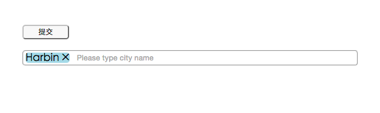
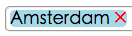
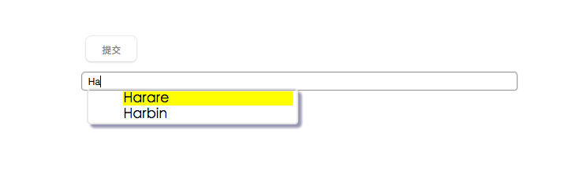
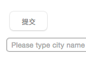
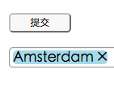
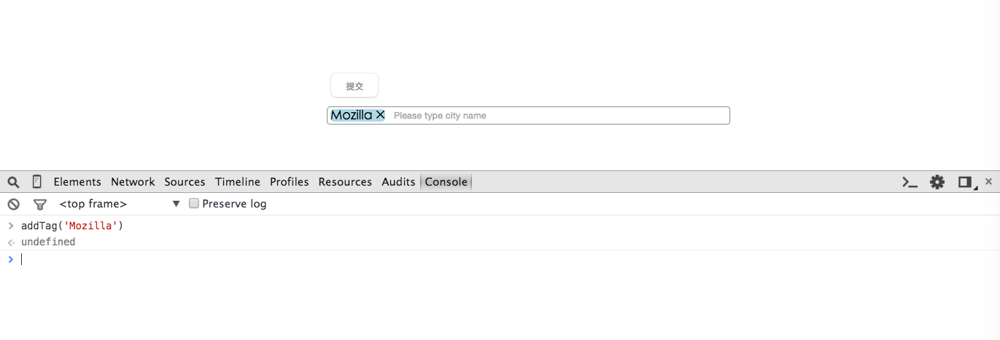
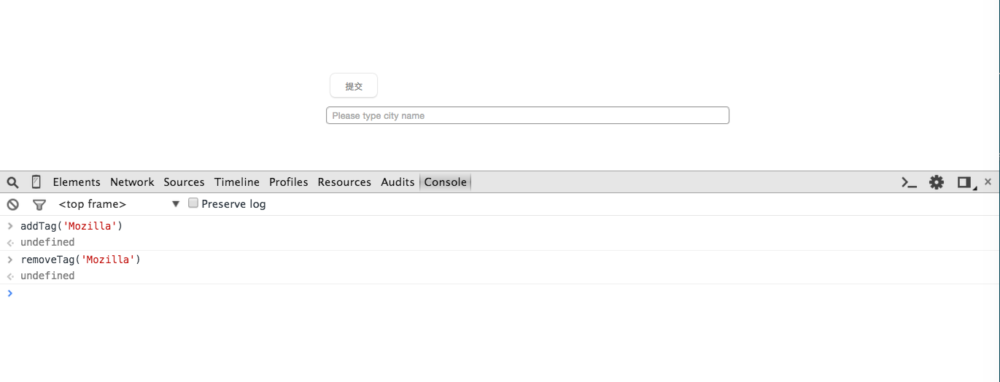
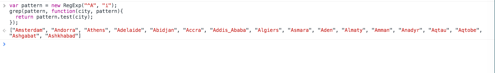

# Introduction

This is a pre-test of Mozilla Taiwan front-end engineer. This project is not perfect. I open it for reference and welcome for improvement.

# Requirement

1. Avoid use any well-known UI libraries ( Like jQuery )
2. The dataset should contain 100 ~ 1000 entries. Timezone names in tzdata 
[1] is a good example, but you don't need to load the JSON example [2] 
as-is.
3. User should be blocked from submit the input unless the input matches 
one of the entries.
4. The whole thing should work when loading from `http://localhost/` or `file:/// 
url`, without server-side (e.g. PHP) logic.
5. Please take care of memory consumption and efficiency.
6. Consider making your code unit-testable and reusable.

[1] [https://en.wikipedia.org/wiki/Tzdata](https://en.wikipedia.org/wiki/Tzdata)<br>
[2] [https://github.com/mozilla-b2g/gaia/blob/master/shared/resources/tz.json](https://github.com/mozilla-b2g/gaia/blob/master/shared/resources/tz.json)

## How did I do?
1. I used \<list>, \<span> and \<input> to finish this test.

	

	When type in a letter, `onkeyup` event triggers `query()` handler to query for autocompletion. Each confirmed input will be inserted into a span as an entry of list.
	
	```
	<ul>
		<li>
			<span>Harbin</span>
		</li>
	</ul>
	```
	After intertion complete, a new span for next insertion will be created.	
	Each inserted tag has a clickable multiply sign. It allows you remove a tag by clicking the sign.

	
	
2. Autocomplete was done by calling a function `grep` with a callback function to do pattern matching.
	```
	set = grep(pattern, function(city, pattern){ 
		  	  return pattern.test(city);
		  });
	```
	What grep does is taking each item in list `timezone` for callback. The reason I used callback is that if the number of matching items is large, or if matching remotely, callback can avoid blocking if network is blocked.

	
	 	
3. After remove a tag, we should check if the instertion list still contains item conforming in timezone. If is, keep submit button enable, otherwise, disable submit button. I reached this goal by checking a global variable `tz_tags` instead of traversing all list again. `tz_tags` will be accumulated each time when a tag conforming in timezone list was added, and will be decelerated each removal.

	  ===>  


# Unit-testable and reusable
We can use web-based test framework, like karma, to do unit test for each function. The following are test by console in web browser.

* addTag()

	

* removeTag()

	

* grep()

	

I separated pattern matching, add and remove tag into individual function. So that we can test each independently.

Because `query()` function need to distinguish keycode of input, I didn't try it in browser console, but this work can be done by using automatic web test tool.